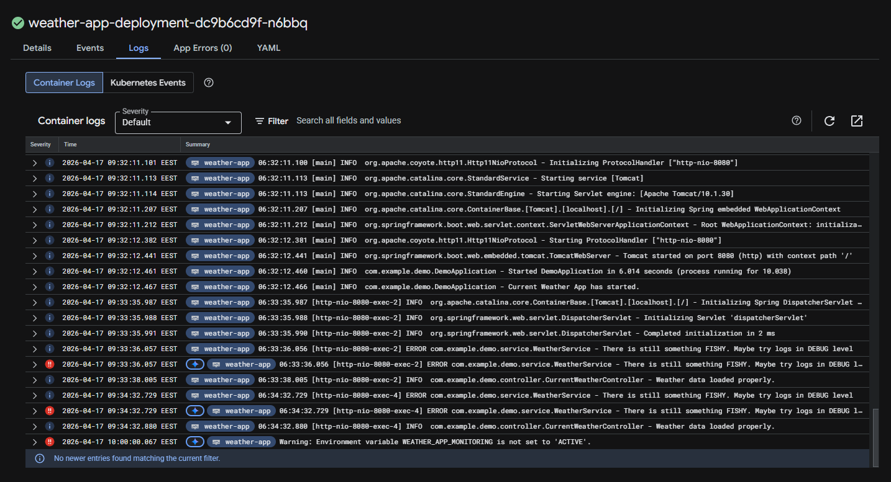

# weather-app

### URL: http://34.116.222.116/

A simple Spring Boot 3 application running on Java 17. Here's a little documentation to get you started.

Config files:
1. `application.properties` — Spring config
2. `log4j2-weather.yml` — logging config

Endpoints:
- `GET /` — calls a weather API and renders the result
---

## Implementation details

This section documents the complete CI/CD and deployment architecture implemented for the Weather App.

### 1. CI/CD pipeline (`.github/workflows/pipeline.yml`)

TheGitHub Actions pipeline has been set up to automate the build, test, scan, and deployment process. The pipeline is triggered on pushes and pull requests to the `master` branch and is divided into four distinct stages.

#### **Stage 1: `build-and-test`**
- **Trigger:** Runs on every push and pull request.
- **Actions:**
  - Checks out the source code.
  - Sets up a Java 17 environment using Amazon Corretto.
  - Runs Maven unit tests. The `OPENWEATHERMAP_API_KEY` is passed as a secret to ensure tests that require the API key can pass.
  - Builds a Docker image tagged as `weather-app:latest`.
  - Saves the Docker image as a `.tar` file and uploads it as a workflow artifact (`weather-app-image`) to be used by subsequent jobs.

#### **Stage 2: `scan-and-push`**
- **Trigger:** Runs only on pushes to the `master` branch, after `build-and-test` succeeds.
- **Security:** Uses keyless authentication to Google Cloud via Workload Identity Federation.
- **Actions:**
  - Downloads and loads the Docker image artifact.
  - **SAST Scan:** Uses **Trivy** to scan the container image for `CRITICAL` and `HIGH` severity vulnerabilities. A `.trivyignore` file is used to whitelist accepted CVEs.
  - Pushes the image to **Google Artifact Registry** in the `europe-central2` region with a unique tag based on the Git commit SHA.

#### **Stage 3: `provision-infrastructure`**
- **Trigger:** Runs only on pushes to the `master` branch, after `scan-and-push` succeeds.
- **Technology:** Uses **Terraform** to manage infrastructure.
- **State Management:** Terraform state is stored remotely and securely in a **Google Cloud Storage bucket**, configured via the `GCS_BUCKET_NAME` secret.
- **Actions:**
  - Authenticates to Google Cloud.
  - Runs `terraform apply` within the `terraform-gcp` directory to create or validate the following resources:
    - A **Google Kubernetes Engine cluster** named `weather-app-gke`.
    - The cluster is configured to use `pd-standard` disks to avoid SSD quota limits.
    - Deletion protection is explicitly disabled (`deletion_protection = false`) for easy management in this non-production environment.

#### **Stage 4: `deploy-application`**
- **Trigger:** Runs only on pushes to the `master` branch, after `provision-infrastructure` succeeds.
- **Actions:**
  - Authenticates to Google Cloud and installs the `gke-gcloud-auth-plugin`.
  - Connects `kubectl` to the GKE cluster.
    - Replaces `IMAGE_PLACEHOLDER` with the full Artifact Registry image path and commit SHA.
    - Replaces `API_KEY_PLACEHOLDER` with the `OPENWEATHERMAP_API_KEY` from GitHub Secrets.
  - **Deployment:** Applies the updated Kubernetes manifests to the cluster:
    -  Creates a Kubernetes `Secret` for the API key and a `Deployment` to run the application pods.

### 2. Infrastructure and deployment (Google Cloud)

#### **Terraform (`terraform-gcp/`)**
- Provisions a GKE cluster and a node pool in the `europe-central2` region.
- The configuration is parameterized using a `variables.tf` file.
- Uses remote state management by storing the state in a Google Cloud bucket.
#### **Kubernetes (`k8s/`)**
- **`deployment.yaml`**:
  - Defines a `Secret` to securely hold the OpenWeatherMap API key.
  - Defines a `Deployment` to run two replicas of the weather app. The API key from the secret is passed to the pods as an environment variable (`OPENWEATHERMAP_API_KEY`).
  - Defines a `Service` of type `LoadBalancer` to expose the application within the cluster.

### 3. Application and containerization

#### **Dockerfile**
- A multi-stage `Dockerfile` is used for efficient and secure builds.
- **Build & Test Stage:** Uses a Maven base image to build the Java application.
- **Scan & Push Stage:** Uses a lightweight `amazoncorretto:17-alpine` base image.
  - The container includes a shell script `check_env.sh` that verifies if the `WEATHER_APP_MONITORING` environment variable is set to `ACTIVE`.
  - A cron job defined in `weather-app-cron` runs this script every hour, logging a warning to `stderr` if the check fails.
  - An `entrypoint.sh` script starts the `crond` service and the Java application.

### 4. Secrets management

- **`OPENWEATHERMAP_API_KEY`**: Stored as a GitHub Secret and securely passed to the unit test stage and the Kubernetes deployment.
- **`GCP_PROJECT_ID`**: Stored as a GitHub Secret and used by Terraform and the deployment job.
- **`GCS_BUCKET_NAME`**: Stored as a GitHub Secret and used to configure the Terraform backend.
- **`WORKLOAD_IDENTITY` & `SERVICE_ACCOUNT`**: Used for secure, keyless authentication between GitHub Actions and Google Cloud.

## Logs from the weatherapp:

### app.is.everything.ok set to false:

### env variable not set:

