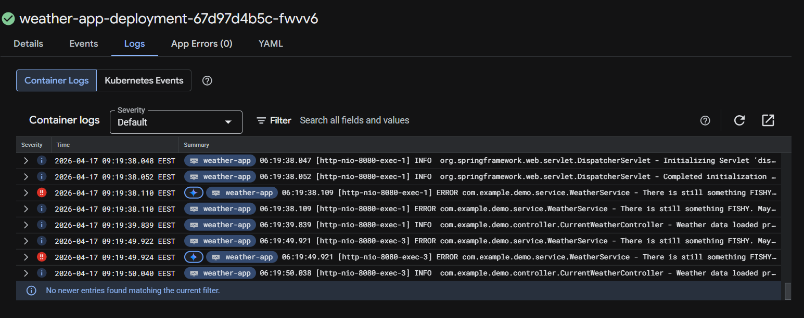

# devops-homework

Welcome, weary traveler! You have arrived at our homework for applicants of our DevOps Engineer position. Here are the instructions you should follow. Good luck, and may the odds be ever in your favour!

## The app

A simple Spring Boot 3 application running on Java 17. Here's a little documentation to get you started.

Config files:
1. `application.properties` — Spring config
2. `log4j2-weather.yml` — logging config

> **Note:** don't be afraid to edit the said two config files. On the contrary, that's part of the question.

Endpoints:
- `GET /` — calls a weather API and renders the result

## The exercise

1. **Fork this repository.**

2. **Build a GitHub Actions pipeline** triggered on push and pull request to the main branch, with the following steps:
   1. Unit tests run
   2. Docker image built
   3. Docker image pushed to an artifact repository
   4. _(Absolutely optional)_ SAST/DAST scans somewhere in the pipeline

3. **Deploy the application** to any cloud provider of your choice. Calling the `/` endpoint should show the weather conditions of **Miskolc**!
   1. _The catch:_ place a shell script in the container that runs every hour to check whether a specific env var is set in the container; if it's not, it should log to stderr. The name and value of the env var is totally up to you.
   2. _(Optional)_ Even with the application running, there might be a suspicious error message appearing in the logs after calling the endpoint. Feel free to investigate and fix it.

Please send us the URL of **the forked repository** and the **URL of the deployed web application**.

Thank you!
